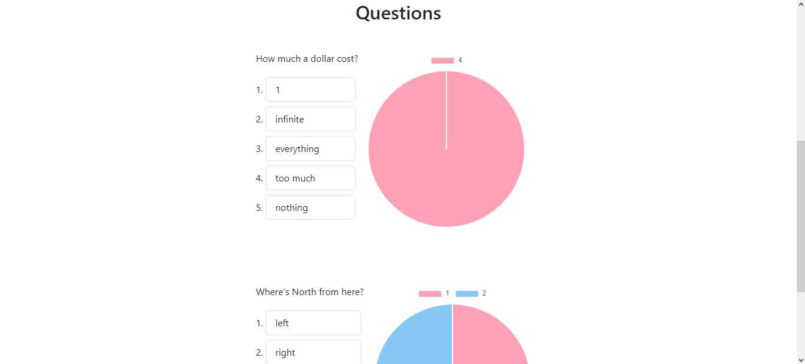

# Frontend

This is an Angular Web application.

## Table of contents

- [Setup instructions](#setup-instructions)
- [Pages](#pages)

###

## Setup instructions

### Installing dependencies

```
npm install
```

### Starting the app

```
ng serve
```

## Pages

### Login and registration pages

<p align="middle">
  
   
</p>

### Initial page


### Survey creation page

<p align="middle">
  
   
</p>

### Survey response page

<p align="middle">
  
   
</p>

### Survey statistics page

<p align="middle">
  
   
</p>

## Pages details

<table>
<tr>
<td> Pages </td> <td> Usage </td> <td> Users allowed to access</td>
<td> Path</td>
</tr>

<tr>
<td> Sign in page </td> <td> Allow users to log in the app, giving them permission to access other pages. </td> <td> All</td> <td> *root*/login </td>
</tr>

<tr>
<td> Sign up page </td> <td> Allow users to create an account on the app. </td>
<td> All</td> <td> *root*/registration </td>
</tr>

<tr>
<td> Initial page </td> <td> For coordinators, it shows all surveys created by them. For respondents, it shows all surveys registered on the app. </td>
<td> All</td> <td> *root*/initial-page </td>
</tr>

<tr>
<td> Survey creation page </td> <td> Accessed from the initial page. Allow coordinators to create a survey. </td>
<td> Coordinators </td> <td> *root*/survey-creation-page </td>
</tr>

<tr>
<td> Survey response page </td> <td> Accessed from the initial page. Allow respondents to submit a response to a survey. </td>
<td> Respondents </td> <td> *root*/survey/:id </td>
</tr>

<tr>
<td> Survey statistics page </td> <td> Accessed from the initial page. Allow users to see the results of a survey. </td>
<td> Coordinators (whenever they want) and respondents (when survey is finished) </td>
<td> *root*/survey/:id </td>
</tr>

</table>
